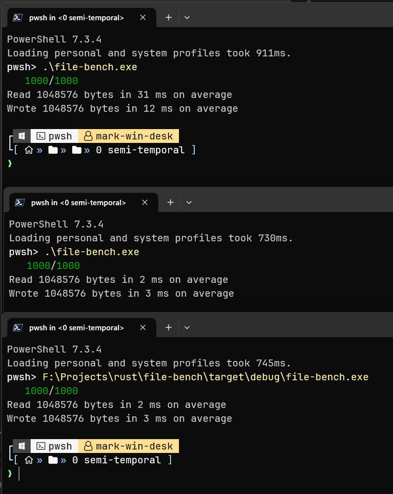

# Rust File IO Benchmarking Tool

This is a simple command line tool written in Rust, aimed at benchmarking the overheads of Google Drive and OneDrive clients. It measures the time taken to read and write files of a particular size repeatedly.

The application creates a file of a specified size and then opens it in a loop, measuring the time taken for reading and writing operations. The number of iterations and the size of the file are configurable.

## Usage

Simply run the program using the Rust compiler (`cargo run`). It doesn't take any command-line arguments. The size of the file chunk and the number of iterations are hardcoded in the source file and can be adjusted according to your needs.

## Output

The output of the program is the average time in milliseconds it takes to read and write a file of the specified size. The output is printed to the console in the following format:

```
Read {file size} bytes in {average read time} ms on average
Wrote {file size} bytes in {average write time} ms on average
```

## Example results. 
Google drive, onedrive and bare metal ssd in order.
